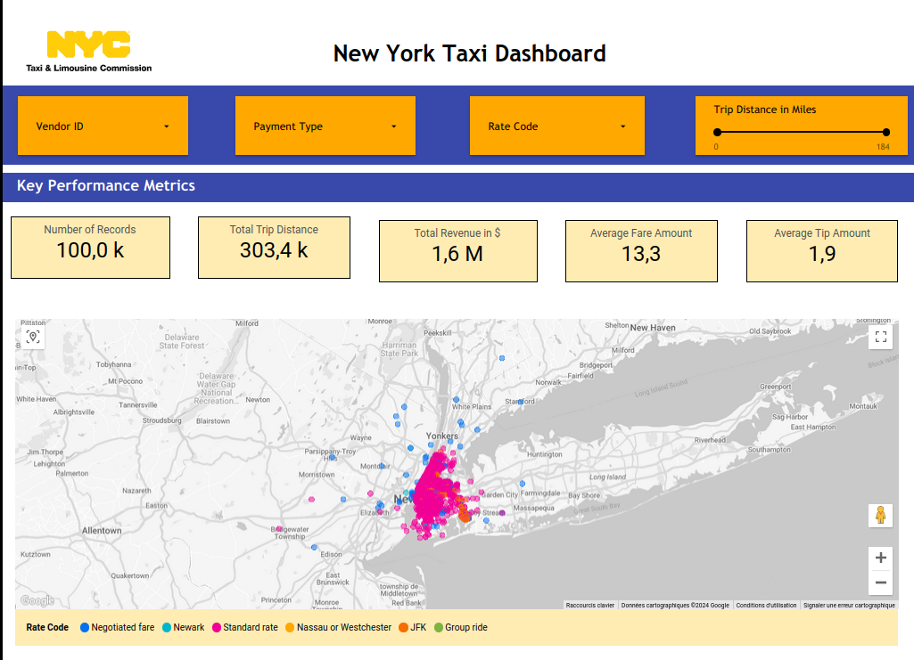
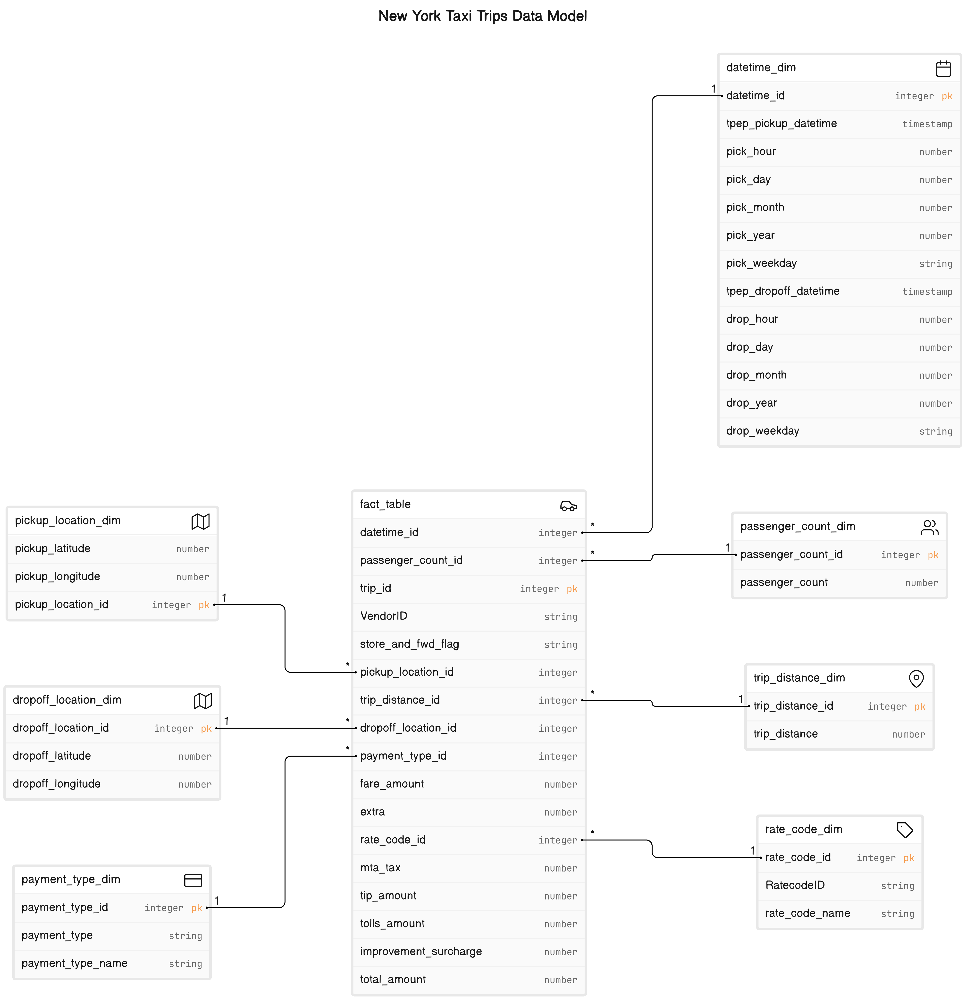
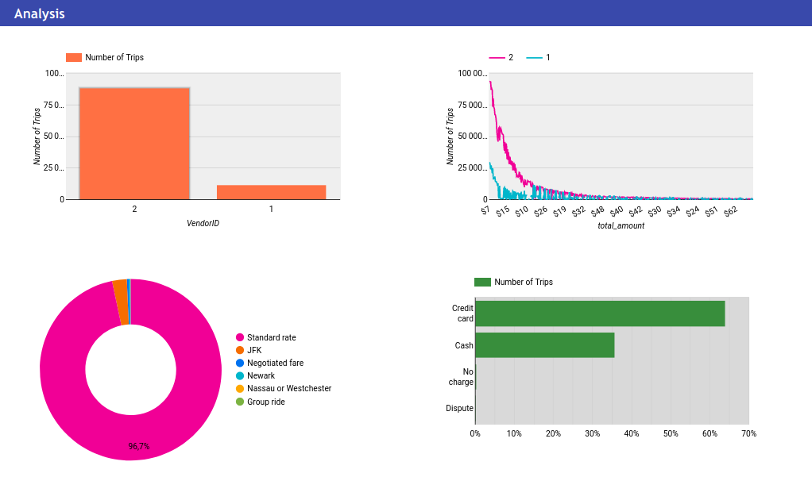
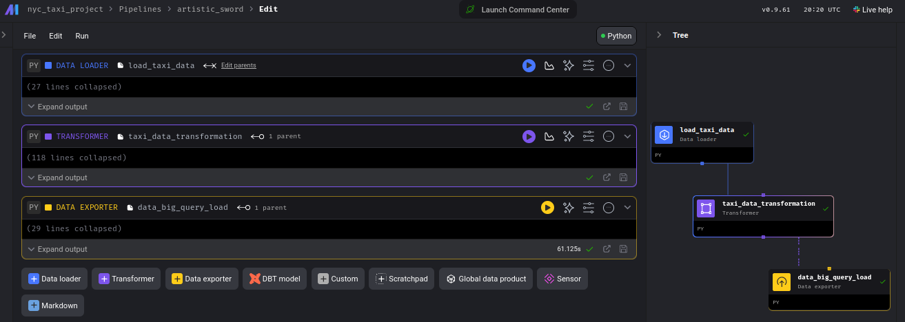

  <h1>🚖 New York Taxi Trips Analysis Project</h1>

## 📖 Project Overview
This project involves a comprehensive analysis of New York Taxi Trips, aiming to extract insights from raw taxi trip data through data transformations and visualizations. The project leverages Google Cloud Platform (GCP) services such as Cloud Storage, Compute Engine with Mage AI, BigQuery, and Looker Studio.

  

  <a href="https://lookerstudio.google.com/reporting/c83c7427-061a-487e-9899-4ebdb222cffe" target="_blank">Looker Dashboard</a>

## 🏛️ Architecture 
The overview of the process to transform the data and make it available for analysis

## 🌐 Data Source
The raw data for this project is sourced <a href="https://www.nyc.gov/site/tlc/about/tlc-trip-record-data.page" target="_blank">here</a>. This dataset includes detailed records of taxi trips in New York City.

### 📚 Data Dictionary
A comprehensive data dictionary is available [here](https://www.nyc.gov/assets/tlc/downloads/pdf/data_dictionary_trip_records_yellow.pdf).

## 📐 Data Model
The data modeling process involved creating a structured data warehouse design using facts and dimension tables. A final reporting layer table was created on the top. The separation makes it easier to manage like changes in business requirements often result in changes to dimensions rather than facts.

### 📊 Fact Tables
- Central table in the data model, containing quantifiable data that can be measured, and analyzed about each trip, like trip duration, distance, and cost. Fact tables typically contain foreign keys that correspond to primary keys in the dimension tables.

### 🗃️ Dimension Tables

- Dimension tables are used to add descriptive information to the numerical measurements in the fact table, such as time, location, or other categories. These attributes are often textual fields or discrete numbers that behave like text

## 🌩️ GCP Services Used
1. **Cloud Storage**: Storing the raw data.
2. **Compute Engine**: Hosting Mage AI for data transformation.
3. **BigQuery**: Data warehousing for storing the transformed data.

## 🔁 Data Transformation and Loading
Data transformation was executed using [Mage AI](https://www.mage.ai/) on a Compute Engine VM instance, and the processed data was subsequently loaded into BigQuery for analysis.

## 📈 Analytics and Reporting
Final analytics and reporting tables in BigQuery were created by synthesizing facts and dimensions, enabling comprehensive analysis and facilitating complex querying capabilities.

## 📊 Dashboarding with Looker Studio
A dashboard was designed in Looker Studio to visualize insights from the taxi trips data, featuring various visualizations like maps, charts, and tables.

### 📸 Dashboard Snapshots
- 
- 
- 

